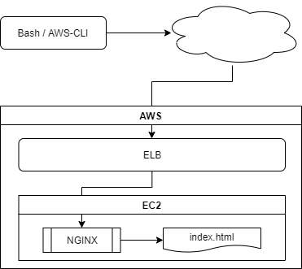

# CSPL - AWS Challenge for Cisco Application

## General Schema

## AWS Components
- Elastic Load Balancer (Classic ~~or Application?~~) (done)
- EC2 instance (Ubuntu) (done)
- Security group to configure remote access ~~?~~ (done)

## Other Components

### In EC2 Ubuntu
- NGINX inside EC2 Ubuntu (done)
- HTML file (echo'ing out after nginx install doesn't work, breaks nginx install: --> will implement seperate copy of prebuilt file instead)

#### Additional Options
- Autoscaling Group
- VPC definition
- S3 Bucket to store status?

### Locally
- BASH script to control overall process
- Terraform to manage installation/maintenance (in progress)
- AWS-CLI for direct communication with AWS API (likely not necessary as TF has its own module for this)

## Encountered Issues I need to solve
- `terraform apply` fails when trying to install NGINX and echo'ing out the html file is enabled, need to find another way to submit the file
- Generating dynamic SSH key doesn't work yet, but static keys do work

## Open Questions / Topics to Check 
- ~~Which ELB service to use, classic or application? (need to read)~~ classic ELB
- ~~Is a security group necessary when using ELB? (reading as well)~~ yes, sec. groups necessary and implemented
- DNS (probably unneeded here)

## Script: Tasks to Cover
- Check if service is already existing, verify status
- Create/update/destroy ELB
- Create/update/destroy EC2 instance (and attached security group if used)
- If necessary update S3 with status
- setup VPC if resp. parameter is set
- configure Autoscaling if resp. parameter is set
