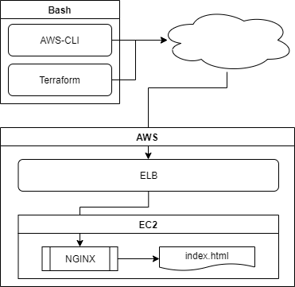

# CSPL - AWS Challenge for Cisco Application

## General Schema

## AWS Components
- Elastic Load Balancer (Classic or Application?)
- EC2 instance (Ubuntu)
- Security group to configure remote access?

## Other Components

### In EC2 Ubuntu
- NGINX inside EC2 Ubuntu
- HTML file

#### Additional Options
- Autoscaling Group
- VPC definition
- S3 Bucket to store status?

### Locally
- BASH script to control overall process
- Terraform to manage installation/maintenance
- AWS-CLI for direct communication with AWS API

## Open Questions / Topics to Check 
- Which ELB service to use, classic or application? (need to read)
- Is a security group necessary when using ELB? (reading as well)

## Script: Tasks to Cover
- Check if service is already existing, verify status
- Create/update/destroy ELB
- Create/update/destroy EC2 instance (and attached security group if used)
- If necessary update S3 with status
- setup VPC if resp. parameter is set
- configure Autoscaling if resp. parameter is set
